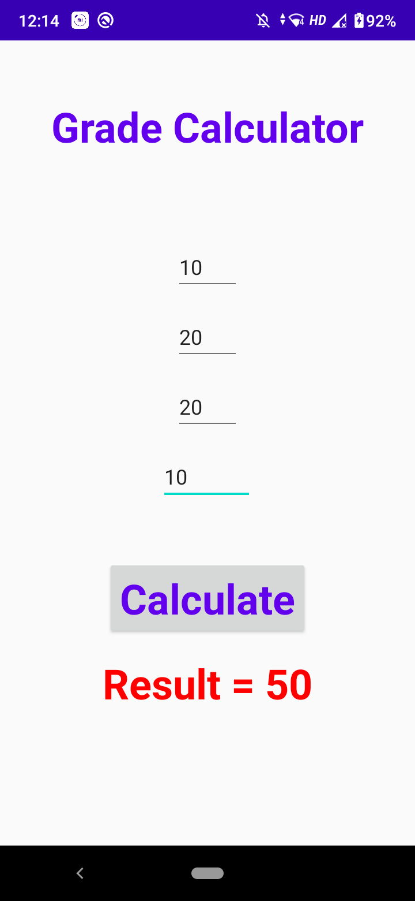

# Grade Calculator

_28th September 2020_

## Question

Create CIE computing application for demonstrating the use of controls: Enter three test marks for 20 each and AAT for 10 marks. Calculate average of best of two tests, add with AAT and compute the total CIE marks. Display the result in green if the candidate has passed, else red.

## Screenshots

  

