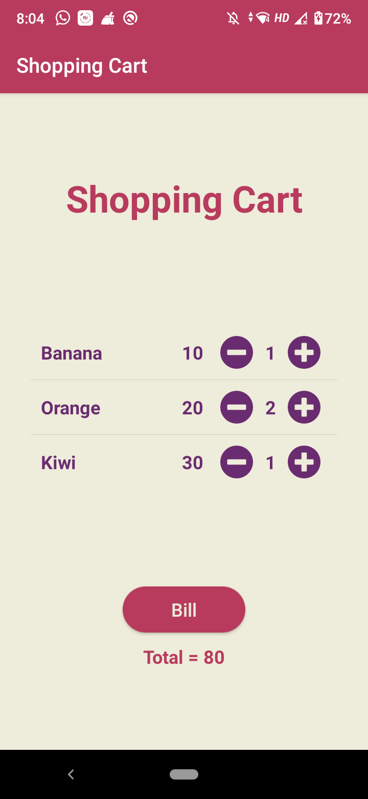

# Shopping Cart

_5th October 2020_

## Question

Develop an interactive shopping cart with predefined items, their costs and their quantities. Make use of a ListView to display the items and provide the user with the total bill amount.

## Screenshots

  

